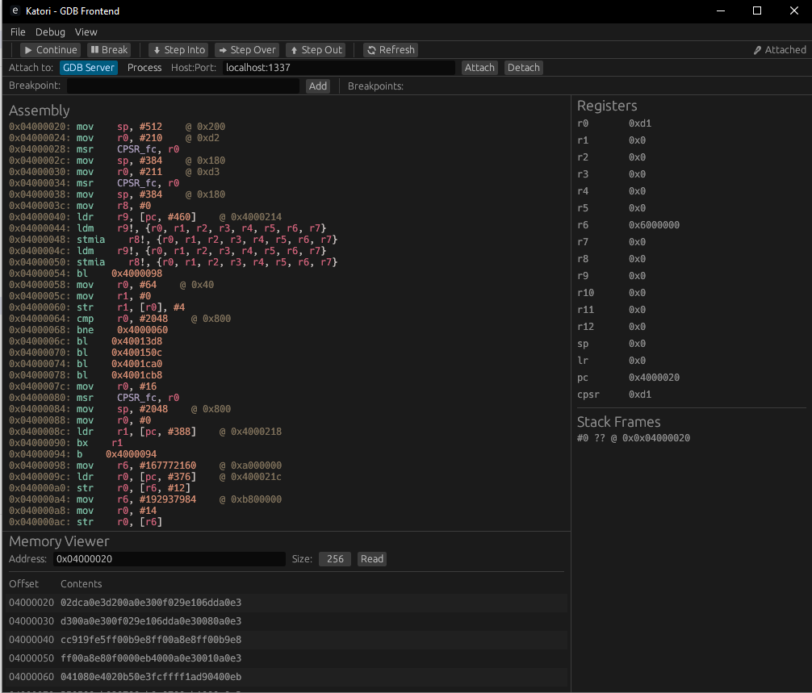

# Katori

A modern GDB frontend written in Rust with a modular architecture.



- **Native Desktop GUI**: Built with egui/eframe for cross-platform compatibility
- **Modular Architecture**: Separate packages for GUI and GDB adapter
- **Robust GDB Integration**: Full GDB/MI protocol support with comprehensive parsing
- **Async Architecture**: Non-blocking GDB communication
- **Comprehensive Testing**: Unit and integration tests for reliability

## STATUS: [WIP] Work in Progress

Under heavy development. The project is not yet ready for production use. Not accepting Issues or PRs at this time.


## Project Structure

- `katori` - Main workspace and entry point
- `katori-gui` - GUI frontend using egui/eframe
- `gdbadapter` - GDB/MI protocol adapter (can be extracted as standalone crate later)

## Quick Start

```bash
# Build and run
cargo run

# Run tests
cargo test

# Test only the GDB adapter
cargo test -p gdbadapter
```

## Architecture

### GUI (katori-gui)
- Modern immediate-mode GUI using egui
- Standalone desktop application (no browser required)
- Session management, breakpoint control, console output
- Async-ready for real-time debugging

### GDB Adapter (gdbadapter)
- Complete GDB/MI protocol implementation
- Robust parsing of all GDB output formats
- Async process management with tokio
- Comprehensive error handling
- Fully tested with unit and integration tests

## Dependencies

- **GUI**: egui, eframe, tokio
- **GDB Adapter**: serde, tokio, regex, thiserror
- **Testing**: Various test utilities and mock data

## Documentation

See `gdbadapter/README.md` for detailed usage of the GDB adapter API.

## Current Status

- ✅ Project structure and modularization
- ✅ Native desktop GUI framework
- ✅ Complete GDB/MI protocol parser
- ✅ Comprehensive test suite (all tests passing)
- ⏳ GUI-GDB integration (in progress)
- ⏳ Advanced debugging features (planned)

## Requirements

- Rust 2021 edition
- GDB with MI support (currently hardcoded to `C:\msys64\mingw64\bin\gdb-multiarch.exe`)

## Future Features

- Configurable GDB path
- File dialog for loading executables
- Variable inspection
- Memory debugging
- Remote debugging support

## Principle

The main principle of Katori is to run gdb.exe in the background and interact with it using GDB/MI in an interactive fashion.
